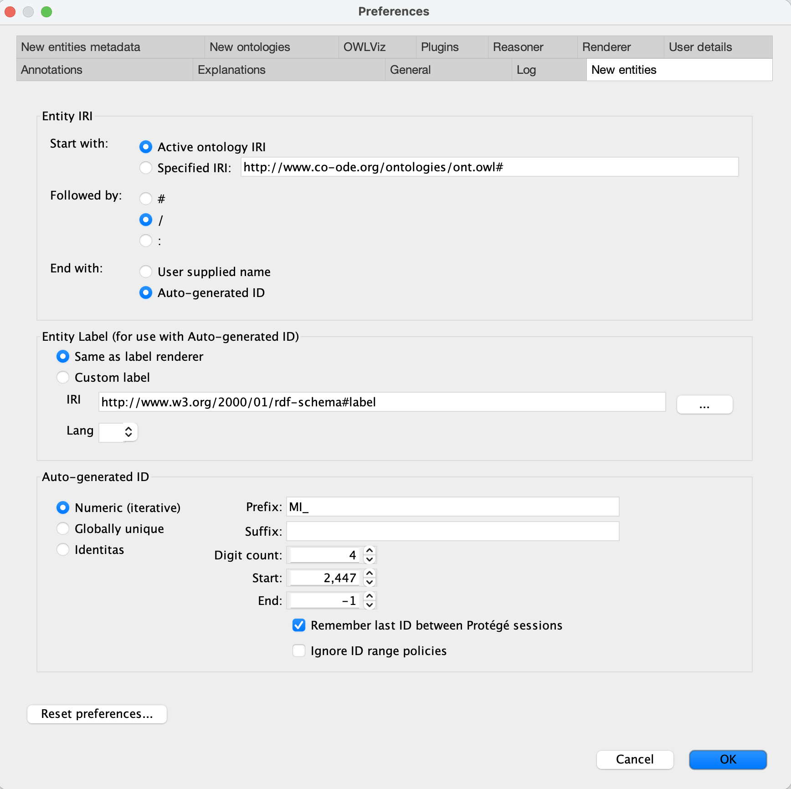
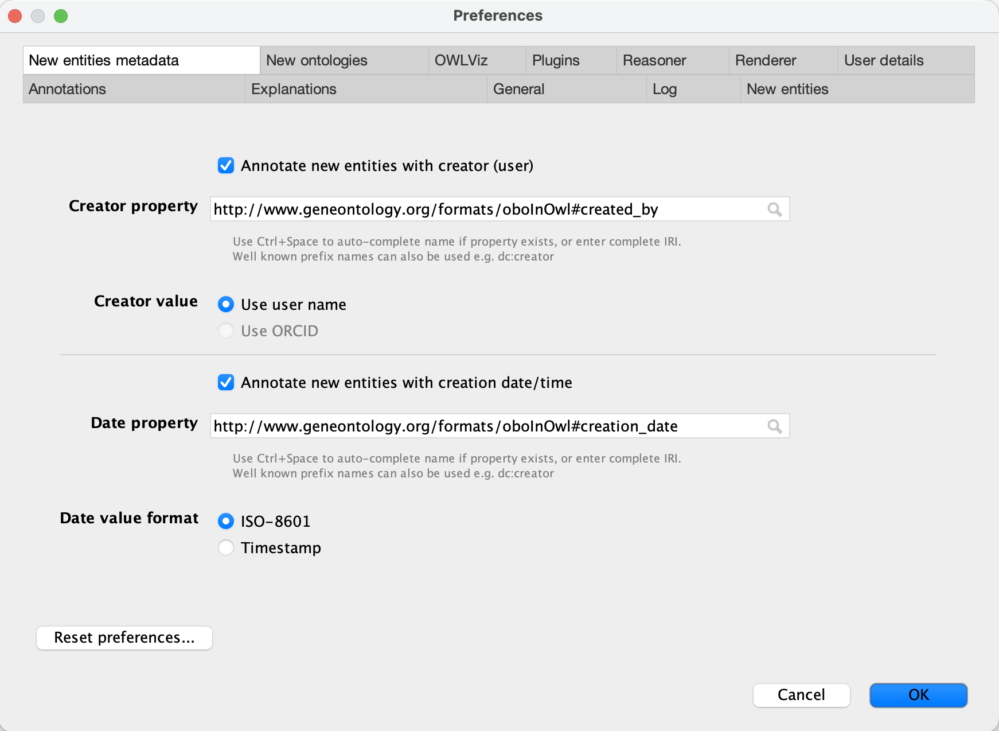
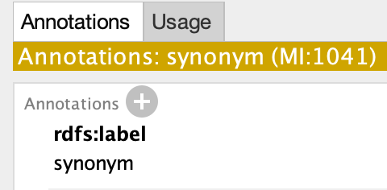
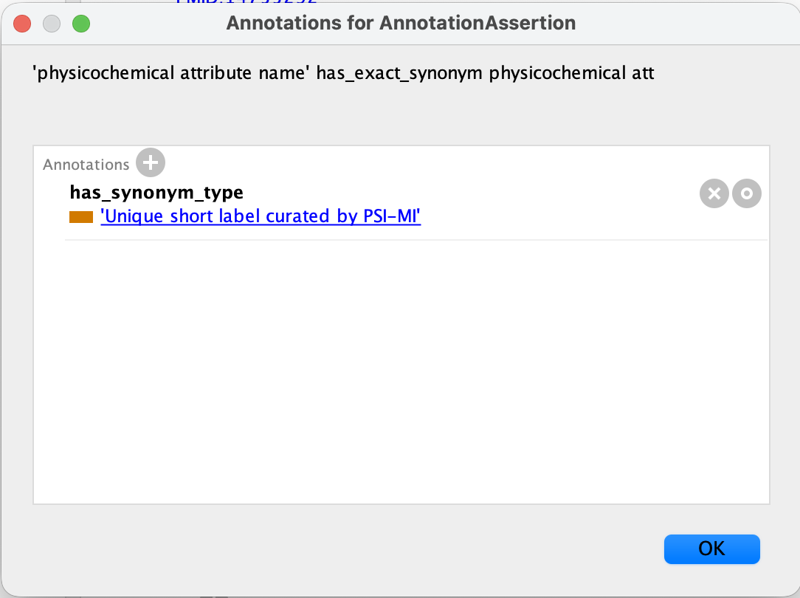
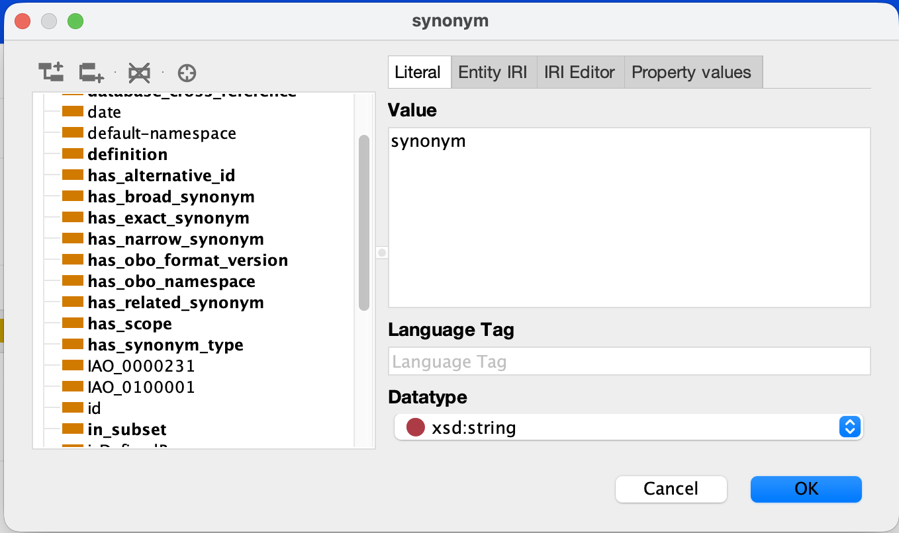
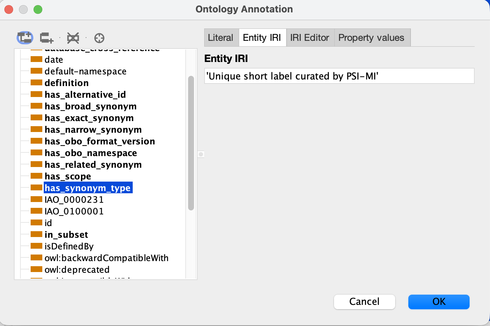
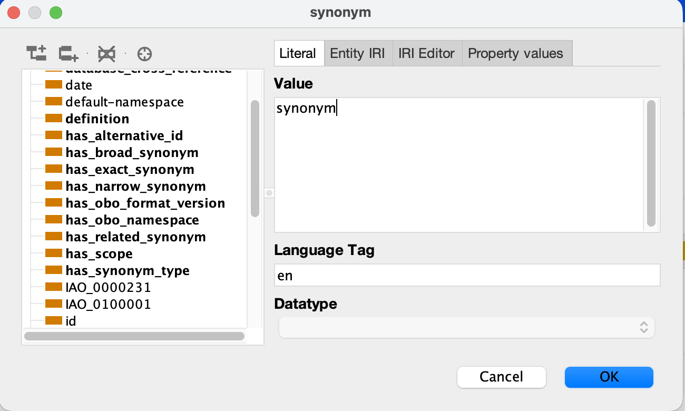
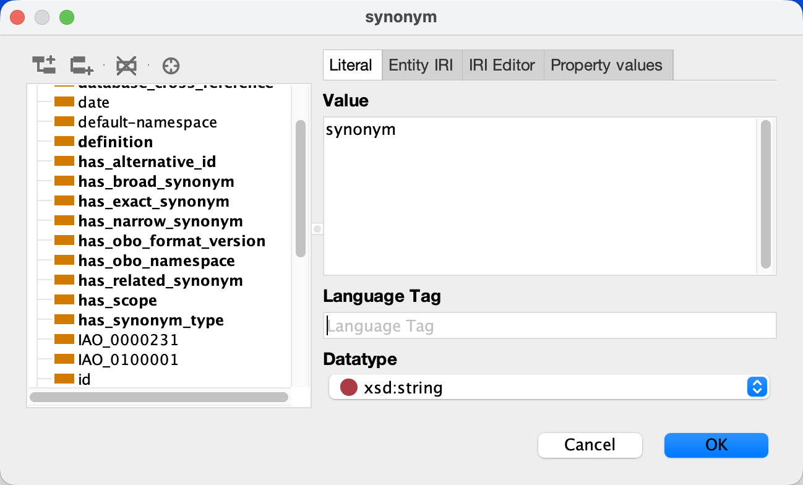
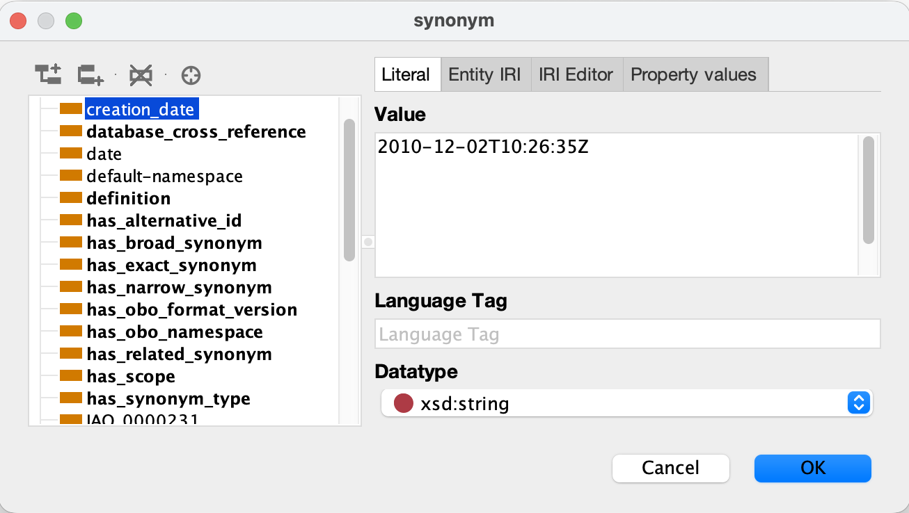
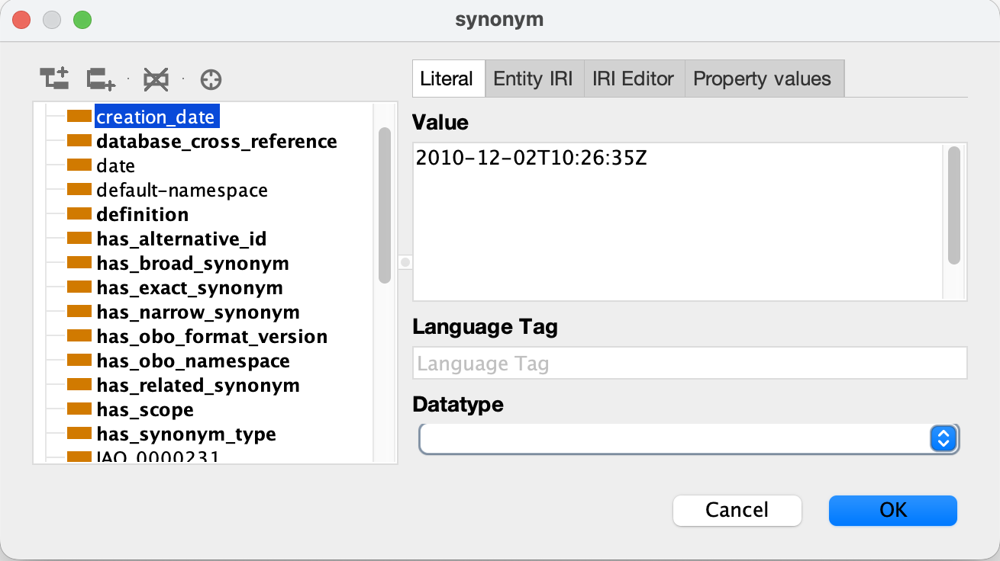

# PSI-MI-CV

Molecular Interactions Controlled Vocabulary

## Contributing

If you need a new entity added to the PSI-MI ontology, you can create a new issue on https://github.com/HUPO-PSI/psi-mi-CV/issues.

Otherwise, you can make you own contributions to the PSI-MI controlled vocabulary using Protege, which you can download from https://protege.stanford.edu/.

### Configure Protege

The first time you use Protege, you must update the settings.

Go to Settings, and to tab 'New entities' and set the different properties as follows.

Then, go to tab 'New entities metadata' and set the properties as follows.

### Open PSI-MI ontology

Go to 'File > Open...', and open the 'psi-mi.owl' file.

### Make changes

On the 'Entities' tab you can find all the PSI-MI entities. Here you can update any of them, delete existing entities or add new ones.

#### Annotation values

To add a new annotation for an entity, click the plus button.

To update an annotation value, click the circle button (on the right).

To delete an annotation, click the 'X' button (in the middle).

To add or edit nested annotations to an existing annotation, click the '@' button (on the left).

Then, click the plus button to add annotations, or click the circle or 'X' buttons to edit or delete annotations.

Some fields, like 'label', use a literal value.

Other fields, like 'has_synonym_type', refer to other entries in the ontology, and use 'Entity IRI'.

#### Things to look out for

Sometimes labels have a language tab added to them.

This is not needed and it may cause issues, so make sure to keep the language tag empty.

Similarly, creation_date annotations sometimes have a Datatype added to them.

Also make sure this is left empty.

### Save changes

To save your changes, go to 'File > Save as ...', select 'RDF/XML Syntax' format, and save it with the name 'psi-mi.owl',
overwriting the existing file.

Then, go again to 'File > Save as ...', select 'OBO Format', and save it with the name 'psi-mi.obo',
overwriting the existing file.

Make sure file 'last-id.txt' has been updated with the MI id of the latest entry added to the ontology.

### Update OLS with your changes

OLS updates their entries periodically (weekly or more frequently), reading the PSI-MI controlled vocabulary terms
from the master branch https://github.com/HUPO-PSI/psi-mi-CV/tree/master.

To commit your changes and propagate them to OLS, make your changes on a different branch (or fork), develop if you have the right access
to it, or a different branch. Then, create a pull request to merge the changes to the master branch. These changes will be reviewed
and either the team will ask for changes, or they will be approved and merged.
